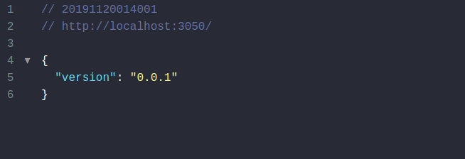

# API-TS

-------

    <a href="#motivation">Motivation</a> &bull;
    <a href="#installation">Installation</a> &bull;
    <a href="#starting">Running</a> &bull;
    <a href="#license">License</a> 

## Motivation
This project is a REST API made in TypeScript (JavaScript super set) with Docker containers, Redis to caching and MongoDB as database.

## Installation

- Clone the project
`git clone wendreof/api-ts`

You will need get Docker: https://www.docker.com/ to run the following steps.

- Turning up

`docker run -d -p 27017:27017 -p 28017:28017 -e AUTH=no tutum/mongodb`

`docker run -d -p 6379:6379 redis`

`docker exec -it redis redis-cli`
 
`docker build .`

## Running

`npm run compile`

`npm start`

- Now, the server is running on port 3050 and is available on browser

 

## License
This project is licensed under the terms of the MIT license. See the LICENSE file.
